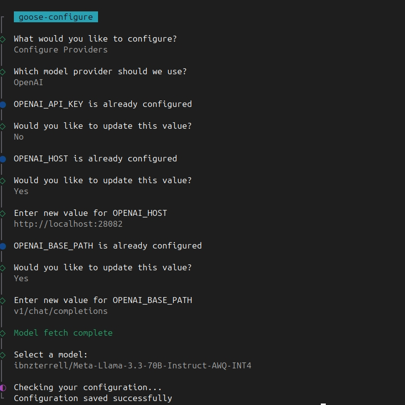

# goose-confidential
How to run goose with confidential llm backend

Go to [PrivateMode](https://www.privatemode.ai/) and create an account and an API key.

Then, set the environment variable `PRIVATE_MODE_API_KEY` to your API key.
You can do this in your terminal with the following command:

```bash
export PRIVATE_MODE_API_KEY=your_api_key_here
```
You can also set this variable in your `.env` file if you are using one.
# Example .env file
```
PRIVATE_MODE_API_KEY=your_api_key_here
```

# Run the application
To run the application, you can use the following command:
```bash
git clone https://github.com/aljazceru/goose-confidential.git
cd goose-confidential
# If you have not installed Docker, please do so first.
# You can find instructions on how to install Docker at https://docs.docker.com/get-docker/
docker compose up -d 
```

For detailed instructions and documentation about privatemode-proxy, please refer to the [privatemode-proxy documentation](https://docs.privatemode.ai/guides/proxy-configuration)

# Configure goose
Run the following command to configure goose to use the privatemode-proxy backend:
```bash
goose configure
```
and follow the instructions in the terminal:

